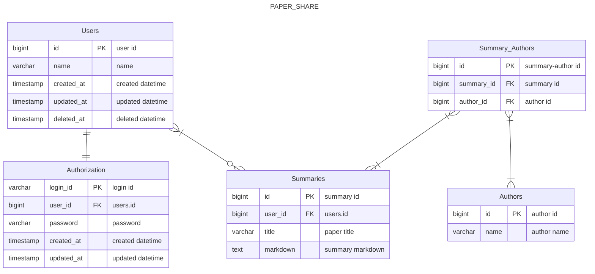

# ER diagram

```mermaid
---
title: "PAPER_SHARE"
---
erDiagram
    Users ||--|| Authorization : ""
    Users }|--o{ Summaries: ""
    Summary_Authors }|--|{ Summaries: ""
    Summary_Authors }|--|{ Authors: ""

    Users {
        bigint id PK "user id"
        varchar name "name"
        timestamp created_at "created datetime"
        timestamp updated_at "updated datetime"
        timestamp deleted_at "deleted datetime"
    }
    Authorization {
        varchar login_id PK "login id"
        bigint user_id FK "users.id"
        varchar password "password"
        timestamp created_at "created datetime"
        timestamp updated_at "updated datetime"
    }
    Summaries {
        bigint id PK "summary id"
        bigint user_id FK "users.id"
        varchar title "paper title"
        text markdown "summary markdown"
    }
    Summary_Authors {
        bigint id PK "summary-author id"
        bigint summary_id FK "summary id"
        bigint author_id FK "author id"
    }
    Authors {
        bigint id PK "author id"
        varchar name "author name"
    }
```
